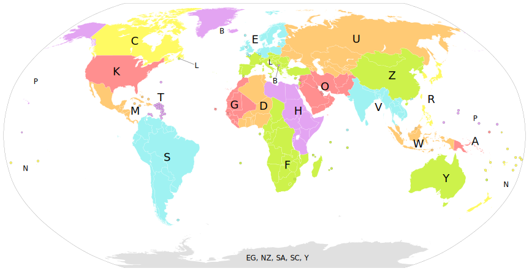

# [Flights Data, _Open Glider Network_](http://wiki.glidernet.org/dev-python)

https://github.com/glidernet/python-ogn-client

```python
beacon = "ICA3DE8F3>OGNSKY,qAS,SafeSky:/090042h5244.30N/00852.09E'140/104/A=001154 !W12! id0C3DE8F3 +000fpm gps2x1"
message = {
  "reference_timestamp": datetime.datetime(2023, 12, 27, 9, 0, 41, 128866),
  "aprs_type": "position",
  "name": "ICA3DE8F3",
  "dstcall": "OGNSKY",
  "relay": None,
  "receiver_name": "SafeSky",
  "timestamp": datetime.datetime(2023, 12, 27, 9, 0, 42),
  "latitude": 52.73835,
  "symboltable": "/",
  "longitude": 8.8682,
  "symbolcode": "'",
  "track": 140,
  "ground_speed": 192.58981928144573,
  "altitude": 351.73920000000004,
  "address_type": 0,
  "aircraft_type": 3,
  "no-tracking": False,
  "stealth": False,
  "address": "3DE8F3",
  "climb_rate": 0.0,
  "beacon_type": "aprs_aircraft",
  "gps_quality_vertical": 2,
  "gps_quality_horizontal": 2,
}

message = {
  "reference_timestamp": datetime.datetime(2023, 12, 27, 10, 27, 29, 711154),
  "aprs_type": "position",
  "name": "FLRD0239F",
  "dstcall": "OGFLR",
  "receiver_name": "lmr64",
  "timestamp": datetime.datetime(2023, 12, 27, 10, 27, 29),
  "latitude": 50.38715,
  "symboltable": "\\",
  "longitude": 11.967016666666666,
  "symbolcode": "n",
  "track": 0,
  "ground_speed": 0.0,
  "altitude": 693.1152000000001,
  "address_type": 2,
  "aircraft_type": 15,
  "address": "D0239F",
  "climb_rate": -0.09652000000000001,
  "turn_rate": 0.0,
  "signal_quality": 4.5,
  "error_count": 3,
  "frequency_offset": -7.0,
  "beacon_type": "aprs_aircraft",
  "gps_quality_vertical": 2,
  "gps_quality_horizontal": 2,
}

```

# [Airports Data, _doc7910_](https://github.com/mborsetti/airportsdata/tree/main)

[airports.csv](./airports.csv)

- `icao`: ICAO 4-letter DOC7910 Location Indicator or (if none) an internal Pseudo-ICAO Identifier [1] (28,133 entries)
- `iata`: IATA 3-letter Location Code (7,588 entries) or an empty string [2]
- `name`: Official name (latin script)
- `city`: City in latin script, ideally using the local language
- `subd`: Subdivision (e.g. state, province, region, etc.), ideally using the local-language or English names of ISO 3166-2
- `country`: ISO 3166-1 alpha-2 country code (plus XK for Kosovo)
- `elevation`: MSL elevation (the highest point of the landing area) in feet; it is often wrong
- `lat`: Latitude (decimal)
- `lon`: Longitude (decimal)
- `tz`: Timezone expressed as a tz database name (IANA-compliant) or an empty string for Antarctica
- `lid`: U.S. FAA Location Identifier (12,567 entries), or an empty string

# [Airlines Data, _doc8585_](https://openflights.org/data.php#airline)

[airlines.dat](./airlines.dat)

- `ID`: Unique OpenFlights identifier for this airline.
- `Name`: Name of the airline.
- `Alias`: Alias of the airline. For example, All Nippon Airways is commonly known as "ANA".
- `IATA`: 2-letter IATA code, if available.
- `ICAO`: 3-letter ICAO code, if available.
- `Callsign`: Airline callsign.
- `Country`: Country or territory where airport is located. See Countries to cross-reference to ISO 3166-1 codes.
- `Active`: "Y" if the airline is or has until recently been operational, "N" if it is defunct. This field is not reliable: in particular, major airlines that stopped flying long ago, but have not had their IATA code reassigned (eg. Ansett/AN), will incorrectly show as "Y".

# [Aircrafts Data, _doc8643_](https://doc8643.com)

> todo: need to crawl to my own database

# [AviationWeather](https://aviationweather.gov/data/api/)

METAR is a common weather report format used by airports around the world.

# [OpenSky-Network](https://opensky-network.org)

Not like the above, seems like a cool, exhaustive data source. Don't know what to do with it yet.

Live API Docs: [OpenSky Network](https://openskynetwork.github.io/opensky-api/)

# [TimeAPI](https://www.timeapi.io/swagger/index.html)

# [OpenLayers](https://openlayers.org/)

Each station has a unique four letter location code assigned by the **International Civil Aviation Organization** (ICAO). The first letter identifies which part of the world the station is in. For instance, all codes beginning with K are within the continental United States.

